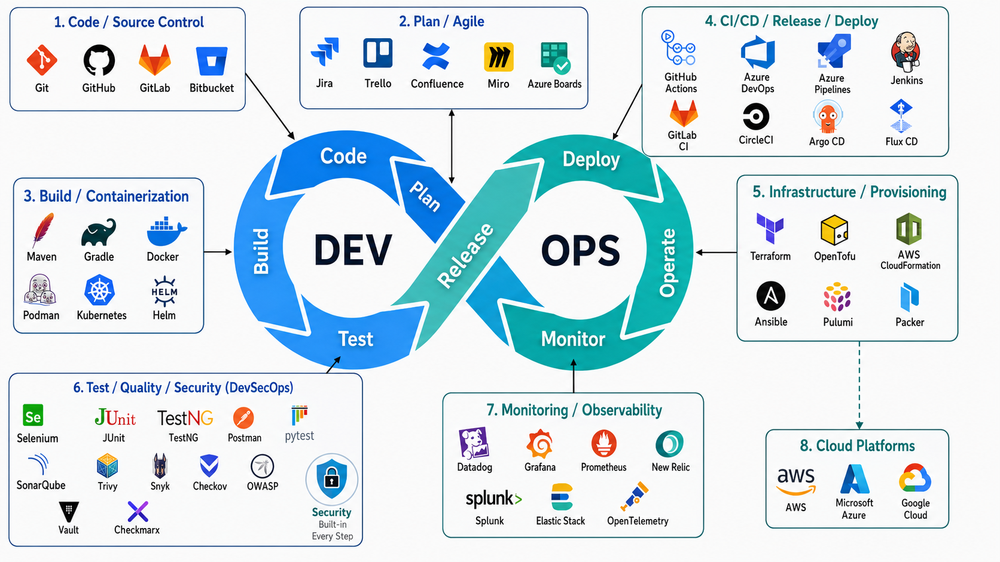

<h1 align="center">Hello 👋, My name is Ursula</h1>

<h3 align="center">
  Multi-Cloud and DevOps Engineer | AWS | GCP | Kubernetes | Terraform
</h3>

  

---

## ♾️ DevSecOps Toolchain Diagram

  

## 👩‍💻 About Me

🔭 I’m currently working with **Amazon Web Services (AWS)** and **Google Cloud Platform (GCP)**.

🌱 I’m expanding my expertise in **Microsoft Azure** and **Artificial Intelligence**.

⚙️ I enjoy building secure, scalable, highly available, and automated cloud infrastructure.

🚀 My areas of interest include **Cloud Engineering, DevOps, Platform Engineering, Infrastructure as Code, CI/CD, Kubernetes, and GitOps**.

🤝 I’m open to collaborating on GitHub projects and contributing wherever I can add value.

👨‍💻 This GitHub account showcases some of the cloud, DevOps, automation, and infrastructure projects I have worked /and still working on.

 

---

## 🛠️ Cloud, DevOps and Platform Engineering Stack

## 🧰 DevOps, Cloud & Agile Stack

<!-- Cloud Platforms -->

<!-- Infrastructure as Code and Configuration Management -->

<!-- Containers and Orchestration -->

<!-- CI/CD and GitOps -->

<!-- Source Control -->

<!-- Monitoring, Logging and Observability -->

<!-- DevSecOps and Code Quality -->

<!-- Operating Systems and Scripting -->

<!-- Databases, Messaging and Caching -->

<!-- Testing and API Tools -->

<!-- Agile, Collaboration and Project Management -->

<!-- Development Tools -->

---

## 📈 GitHub Statistics

  
  

  

---

## 🤝 Connect With Me

  
  

---

  <strong>Thank you for visiting my GitHub profile!</strong>

  <em>Building reliable infrastructure through cloud engineering, automation, and DevOps.</em>

